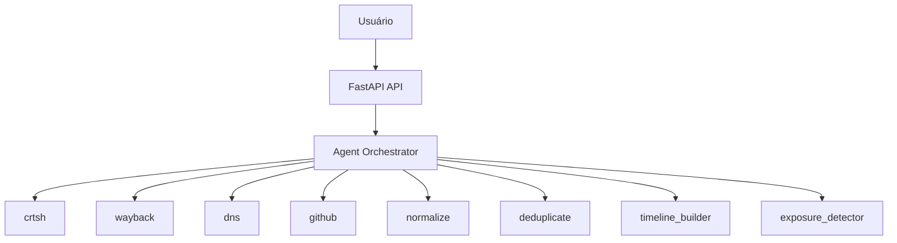

# ⏳ OSINT Time Machine

Reconstrói a evolução histórica do **attack surface** de qualquer domínio, descobrindo subdomínios, certificados TLS, endpoints antigos e possíveis exposições ao longo do tempo.


## ✨ Funcionalidades

- **Timeline por ano** — Subdomínios organizados cronologicamente
- **Múltiplas fontes** — crt.sh (Certificate Transparency), Wayback Machine, DNS, GitHub
- **Detecção de exposições** — Subdomínios sensíveis (dev, staging, admin, etc.)
- **Grafo interativo** — Visualização do attack surface com D3.js (arrastar nós)
- **Export** — PDF e JSON
- **Dark/Light mode** — Tema configurável
- **Histórico** — Último domínios pesquisados (localStorage)
- **Cache** — Resultados em cache para consultas repetidas
- **Rate limiting** — Proteção contra abuso

## 🏗️ Arquitetura



## 🚀 Quick Start

### Com Docker (recomendado)

```bash
# Clone e suba
git clone https://github.com/seu-usuario/osint-time-machine.git
cd osint-time-machine
docker compose up -d

# Acesse http://localhost:5000
```

### Local (Python)

```bash
# Crie o venv e instale
python -m venv venv
source venv/bin/activate  # Windows: .\venv\Scripts\Activate.ps1
pip install -r requirements.txt

# Rode
uvicorn app.main:app --reload --port 5000
```

## 📦 Stack

| Camada | Tecnologia |
|--------|------------|
| Backend | FastAPI, Python 3.11+ |
| HTTP Client | httpx |
| Validação | Pydantic |
| Cache | Redis (opcional) |
| Frontend | Vanilla JS, D3.js |

## 📡 API

### POST `/recon/timeline`

Gera a timeline do attack surface.

**Request:**
```json
{
  "domain": "example.com"
}
```

**Response:**
```json
{
  "domain": "example.com",
  "timeline": {
    "2018": ["dev.example.com", "blog.example.com"],
    "2020": ["api.example.com", "staging.example.com"]
  },
  "exposures": [
    "Subdomínio sensível detectado: staging.example.com (fonte: crtsh)"
  ]
}
```

### GET `/health`

Health check para monitoramento.

## 📁 Estrutura do Projeto

```
osint-time-machine/
├── app/
│   ├── main.py
│   ├── api/routes.py
│   ├── agents/recon_agent.py
│   ├── collectors/          # crtsh, wayback, dns, github
│   ├── processors/          # normalizer, timeline_builder
│   ├── analyzers/           # exposure_detector
│   └── models/
├── static/                  # Frontend
├── tests/
├── Dockerfile
├── docker-compose.yml
└── requirements.txt
```

## 🔧 Variáveis de Ambiente

| Variável | Descrição | Default |
|----------|-----------|---------|
| `REDIS_URL` | URL do Redis para cache | - (cache desabilitado) |
| `GITHUB_TOKEN` | Token para API GitHub | - (coleta limitada) |
| `RATE_LIMIT` | Requisições/minuto por IP | 10 |

## 📄 Licença

MIT
